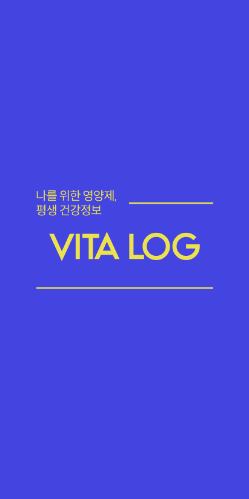
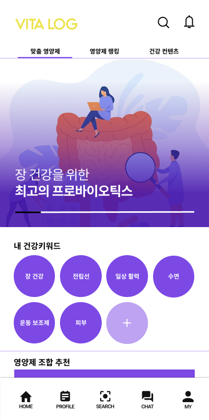
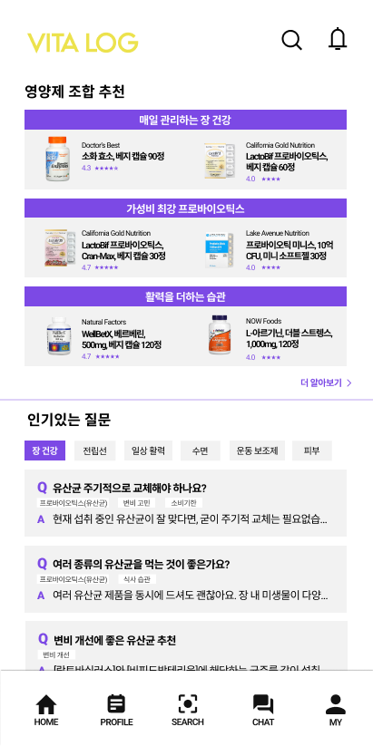
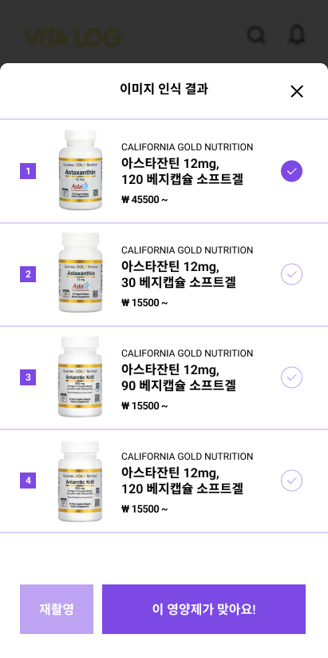

  
  
  
  
  
  
  

  

* People
  * [Yeongjin Kim](https://github.com/kyj950514 "김영진")
  * [dain Hong](https://github.com/daineey "홍다인")

  

* Language / IDE
  * 
  * 
  * 
  * 
  * 
  * 
  * 

  

## UX Design

 

## BluePrint

 

## Service Map

