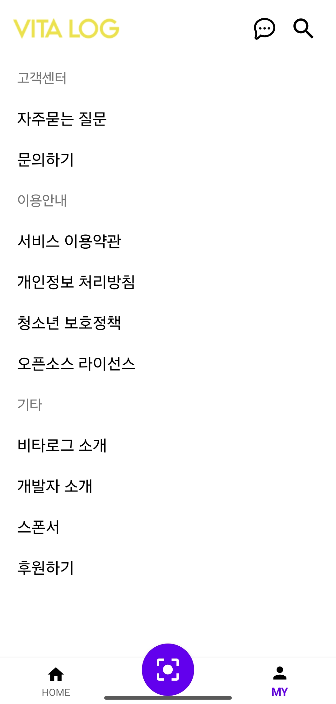

VITALOG is an abbreviation of Vitamin + V-log, which is an app service for managing supplement information and related health history.

Nowadays, awareness and issues of the health and wellness are growing, one of the factors of health care is taking nutritional supplement.
We are going to proceed with a project of nutritional coaching application project through various nutritional contents.

VITALOG provides three high-level features:
- Various nutrition information and latest news/paper contents, and customized nutritional coaching based on user health condition.
- Manage of health records.
- Search supplement product (detailed information) easily by OCR image search, and do free Q&A about nutritional supplement, run by the LLM AI Chatbot.

<!-- toc -->

- [Development](#development)
- [Demonstration](#demonstration)
- [UX Principle](#ux-principle)
- [Service Map](#service-map)
- [BluePrint](#blueprint)
- [YouTube](#youtube)
- [Language / IDE](#language-ide)
- [GPT-4 API Key](#gpt-4-api-key)
- [The Team](#the-team)
- [License](#license)

<!-- tocstop -->

## Development


## Demonstration

<p align="left">
  
  
  
  
  
  
  
  
  
  
  
  
</p>

## UX Principle


## Service Map


## BluePrint


## YouTube

[](https://youtu.be/spHKSBqX7LQ?feature=shared)

## Language / IDE

* 
* 
* 
* 

## GPT-4 API Key

Get an API key from the [OpenAI website](https://platform.openai.com).

Put the issued key in the following openAIApiKey line.

```
package com.daineey.vita_log.constants

const val openAIApiKey = ""

const val urlToImageAppIcon = "https://res.cloudinary.com/apideck/image/upload/v1672442492/marketplaces/ckhg56iu1mkpc0b66vj7fsj3o/listings/-4-ans_frontend_assets.images.poe.app_icon.png-26-8aa0a2e5f237894d_tbragv.png"
const val urlToImageAuthor = "https://avatars.githubusercontent.com/u/33478798?v=4"
const val urlToAvatarGPT = "app/src/main/res/drawable/ic_vitalog_app.png"
const val urlToGithub = "https://github.com/YoungJensKR"

const val conversationTestTag = "ConversationTestTag"
```

## The Team

VITALOG is a Hongik University graduation project with two developers contributing to it.

VITALOG is currently maintained by [Yeong-Jin Kim](https://github.com/youngjeanskr), [Da-In Hong](https://github.com/daineey)

## License

VITALOG has a Apache License 2.0, as found in the [LICENSE](LICENSE) file.
